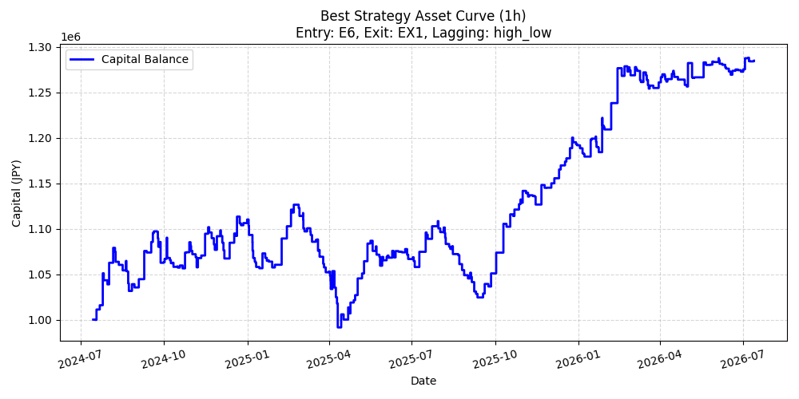
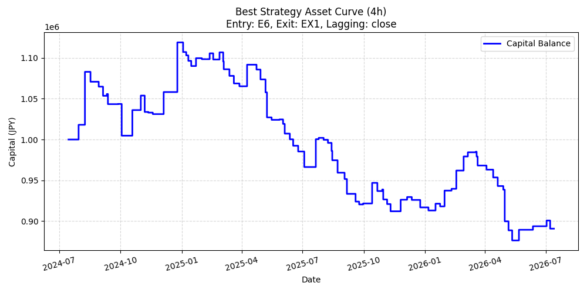
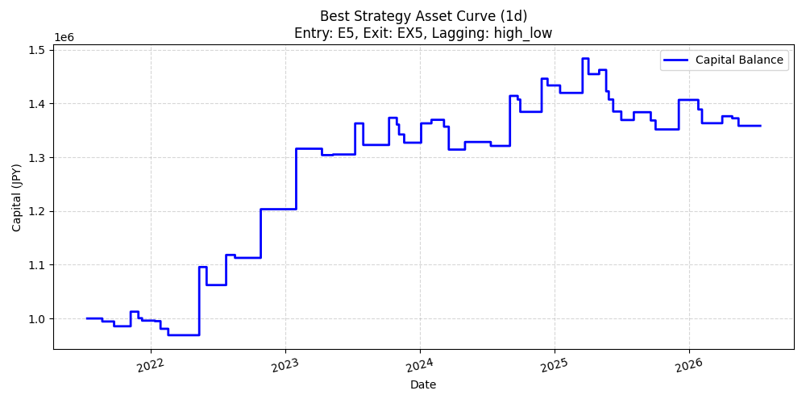

# スーパーボリンジャー取引戦略 バックテスト検証レポート (遅行スパン定義の徹底比較)

生成日時: 2026-07-13 20:59:50

## 概要
ドル円 (USD/JPY) の為替取引において、テクニカル指標「スーパーボリンジャー」をベースにした取引戦略のバックテスト検証を行いました。
エントリー条件（E1-E3）と、エグジット条件（EX1-EX7）、さらに**「遅行スパンの陽転・陰転の判定基準（2種）」**を掛け合わせた計42パターン（エントリー3種×エグジット7種×遅行スパン2種）の組み合わせを、3つの時間軸（1時間足、4時間足、1日足）で比較検証しました。

本検証では、ユーザーの**「ダマシを少なくし、少ないトレード回数で確実にトレンドになる高効率な戦略を採用したい」**という目的に従い、以下の2種類の遅行スパン定義を比較し、最も効率の良いアルゴリズム（PF/取引回数 基準）を探索しました。

### 検証した遅行スパン定義
- **終値基準 (close)**: `Close(t) > Close(t-21)` / `Close(t) < Close(t-21)` (単純終値クロス)
- **高安値基準 (high_low)**: `Close(t) > High(t-21)` / `Close(t) < Low(t-21)` (21日前のピンポイント高安ブレイク)

### 取引基本条件
- **対象ペア**: USD/JPY (`JPY=X` via yFinance)
- **取引数量**: 1万通貨固定 (同時に最大1ポジションのみ、ドテンなしの個別決済)
- **初期資金**: 1,000,000円
- **スワップ/スプレッド**: 考慮しない
- **検証期間**:
  - 1時間足 (1h): 過去2年間 (休場ギャップ排除)
  - 4時間足 (4h): 過去2年間 (1時間足からリサンプル、休場ギャップ排除)
  - 1日足 (1d): 過去5年間 (休場ギャップ排除)

## 各時間軸における最良戦略のまとめ（PF/取引回数 基準）
※信頼性確保のため、総トレード数が5回以上の戦略から選定しています。

### ■ 1H 足における最良戦略: E6 & EX1 (HIGH_LOW)
- **遅行スパン判定基準**: 高安値基準 (Close vs High/Low_21_ago)
- **エントリー戦略**: E6 (E4 & 終値 > +2σ)
- **エグジット戦略**: EX1 (遅行スパン陰転)
- **総トレード数**: 299 回
- **勝率**: 41.47%
- **プロフィットファクター (PF)**: 1.32
- **PF / 取引回数**: **0.00442**
- **合計損益**: **284,880 円**
- **平均損益/トレード**: 953 円
- **最大ドローダウン (DD)**: 135,020 円
- **損益/DD比率 (Return/DD)**: 2.11

---

### ■ 4H 足における最良戦略: E6 & EX1 (CLOSE)
- **遅行スパン判定基準**: 終値基準 (Close vs Close_21_ago)
- **エントリー戦略**: E6 (E4 & 終値 > +2σ)
- **エグジット戦略**: EX1 (遅行スパン陰転)
- **総トレード数**: 87 回
- **勝率**: 34.48%
- **プロフィットファクター (PF)**: 0.81
- **PF / 取引回数**: **0.00927**
- **合計損益**: **-109,330 円**
- **平均損益/トレード**: -1,257 円
- **最大ドローダウン (DD)**: 242,861 円
- **損益/DD比率 (Return/DD)**: -0.45

---

### ■ 1D 足における最良戦略: E5 & EX5 (HIGH_LOW)
- **遅行スパン判定基準**: 高安値基準 (Close vs High/Low_21_ago)
- **エントリー戦略**: E5 (E4 & 終値 > +1σ)
- **エグジット戦略**: EX5 (遅行スパン陰転 or 終値 < 21MA割れ)
- **総トレード数**: 51 回
- **勝率**: 35.29%
- **プロフィットファクター (PF)**: 1.68
- **PF / 取引回数**: **0.03287**
- **合計損益**: **358,340 円**
- **平均損益/トレード**: 7,026 円
- **最大ドローダウン (DD)**: 131,890 円
- **損益/DD比率 (Return/DD)**: 2.72

---

## 💡 遅行スパン定義（アルゴリズム）別の集計・比較分析
どの遅行スパン判定基準が最も優秀だったかを検証するため、全時間軸・全戦略のデータを基準別に集計しました。

### ■ 1H 足における定義別集計
| 遅行スパン定義 | 平均勝率 | 平均PF | 平均合計損益 (円) | 利益プラス戦略数 / 全21通り | 最高PF | 最高合計損益 (円) |
|---|---|---|---|---|---|---|
| CLOSE (終値基準) | 36.6% | 1.25 | 279,638 | 42 / 21 | 1.36 | 351,299 |
| HIGH_LOW (高安値基準) | 37.6% | 1.26 | 280,144 | 42 / 21 | 1.36 | 339,842 |

### ■ 4H 足における定義別集計
| 遅行スパン定義 | 平均勝率 | 平均PF | 平均合計損益 (円) | 利益プラス戦略数 / 全21通り | 最高PF | 最高合計損益 (円) |
|---|---|---|---|---|---|---|
| CLOSE (終値基準) | 34.8% | 0.88 | -75,540 | 4 / 21 | 1.06 | 45,820 |
| HIGH_LOW (高安値基準) | 34.9% | 0.85 | -90,915 | 4 / 21 | 1.05 | 35,230 |

### ■ 1D 足における定義別集計
| 遅行スパン定義 | 平均勝率 | 平均PF | 平均合計損益 (円) | 利益プラス戦略数 / 全21通り | 最高PF | 最高合計損益 (円) |
|---|---|---|---|---|---|---|
| CLOSE (終値基準) | 33.1% | 1.12 | 86,324 | 32 / 21 | 1.57 | 348,350 |
| HIGH_LOW (高安値基準) | 35.5% | 1.16 | 103,262 | 32 / 21 | 1.68 | 358,340 |

## 時間軸別の全戦略比較データ（PF / 取引回数 順、上位15位まで）
全42戦略のうち、PF/取引回数比率が高い上位15戦略を表示します。(詳細データは CSV にて保存されています)

### 1H 足 上位15戦略一覧
| 順位 | エントリー | エグジット | 遅行スパン基準 | トレード数 | 勝率 | PF / 取引回数 | PF | 合計損益 (円) | 最大DD (円) |
|---|---|---|---|---|---|---|---|---|---|
| 1 | E6 | EX1 | HIGH_LOW | 299 | 41.5% | 0.00442 | 1.32 | 284,880 | 135,020 |
| 2 | E3 | EX1 | HIGH_LOW | 318 | 38.7% | 0.00380 | 1.21 | 206,370 | 143,320 |
| 3 | E6 | EX1 | CLOSE | 349 | 38.7% | 0.00374 | 1.31 | 286,420 | 124,260 |
| 4 | E6 | EX3 | HIGH_LOW | 378 | 39.4% | 0.00336 | 1.27 | 237,379 | 94,790 |
| 5 | E6 | EX5 | HIGH_LOW | 379 | 39.3% | 0.00335 | 1.27 | 237,539 | 94,790 |
| 6 | E3 | EX1 | CLOSE | 366 | 37.4% | 0.00333 | 1.22 | 223,170 | 146,020 |
| 7 | E6 | EX3 | CLOSE | 397 | 39.5% | 0.00324 | 1.29 | 262,678 | 90,150 |
| 8 | E4 | EX1 | HIGH_LOW | 399 | 38.3% | 0.00313 | 1.25 | 283,651 | 158,690 |
| 9 | E6 | EX5 | CLOSE | 410 | 37.6% | 0.00313 | 1.28 | 251,889 | 80,050 |
| 10 | E5 | EX1 | HIGH_LOW | 396 | 37.9% | 0.00309 | 1.22 | 254,231 | 163,330 |
| 11 | E6 | EX2 | HIGH_LOW | 450 | 38.4% | 0.00300 | 1.35 | 250,911 | 43,779 |
| 12 | E6 | EX4 | HIGH_LOW | 450 | 38.4% | 0.00300 | 1.35 | 250,911 | 43,779 |
| 13 | E6 | EX6 | HIGH_LOW | 450 | 38.4% | 0.00300 | 1.35 | 250,911 | 43,779 |
| 14 | E6 | EX7 | HIGH_LOW | 450 | 38.4% | 0.00300 | 1.35 | 250,911 | 43,779 |
| 15 | E3 | EX3 | HIGH_LOW | 404 | 38.4% | 0.00298 | 1.20 | 193,560 | 92,490 |

### 4H 足 上位15戦略一覧
| 順位 | エントリー | エグジット | 遅行スパン基準 | トレード数 | 勝率 | PF / 取引回数 | PF | 合計損益 (円) | 最大DD (円) |
|---|---|---|---|---|---|---|---|---|---|
| 1 | E6 | EX1 | CLOSE | 87 | 34.5% | 0.00927 | 0.81 | -109,330 | 242,861 |
| 2 | E6 | EX1 | HIGH_LOW | 76 | 31.6% | 0.00916 | 0.70 | -182,200 | 287,201 |
| 3 | E6 | EX2 | CLOSE | 112 | 38.4% | 0.00883 | 0.99 | -4,310 | 137,200 |
| 4 | E6 | EX6 | CLOSE | 112 | 38.4% | 0.00883 | 0.99 | -4,310 | 137,200 |
| 5 | E3 | EX1 | CLOSE | 90 | 34.4% | 0.00876 | 0.79 | -126,330 | 273,651 |
| 6 | E3 | EX1 | HIGH_LOW | 79 | 32.9% | 0.00873 | 0.69 | -193,460 | 307,950 |
| 7 | E6 | EX2 | HIGH_LOW | 110 | 37.3% | 0.00870 | 0.96 | -17,570 | 153,260 |
| 8 | E6 | EX4 | HIGH_LOW | 110 | 37.3% | 0.00870 | 0.96 | -17,570 | 153,260 |
| 9 | E6 | EX6 | HIGH_LOW | 110 | 37.3% | 0.00870 | 0.96 | -17,570 | 153,260 |
| 10 | E6 | EX7 | HIGH_LOW | 110 | 37.3% | 0.00870 | 0.96 | -17,570 | 153,260 |
| 11 | E6 | EX4 | CLOSE | 113 | 38.1% | 0.00859 | 0.97 | -12,231 | 137,200 |
| 12 | E6 | EX7 | CLOSE | 113 | 38.1% | 0.00859 | 0.97 | -12,231 | 137,200 |
| 13 | E5 | EX1 | HIGH_LOW | 99 | 32.3% | 0.00837 | 0.83 | -107,020 | 272,900 |
| 14 | E4 | EX1 | HIGH_LOW | 103 | 33.0% | 0.00799 | 0.82 | -112,350 | 272,300 |
| 15 | E3 | EX2 | CLOSE | 124 | 37.9% | 0.00790 | 0.98 | -9,290 | 113,050 |

### 1D 足 上位15戦略一覧
| 順位 | エントリー | エグジット | 遅行スパン基準 | トレード数 | 勝率 | PF / 取引回数 | PF | 合計損益 (円) | 最大DD (円) |
|---|---|---|---|---|---|---|---|---|---|
| 1 | E5 | EX5 | HIGH_LOW | 51 | 35.3% | 0.03287 | 1.68 | 358,340 | 131,890 |
| 2 | E5 | EX1 | HIGH_LOW | 40 | 40.0% | 0.03271 | 1.31 | 177,679 | 151,021 |
| 3 | E6 | EX3 | CLOSE | 40 | 35.0% | 0.03263 | 1.31 | 160,700 | 134,170 |
| 4 | E6 | EX3 | HIGH_LOW | 38 | 34.2% | 0.03057 | 1.16 | 88,640 | 160,230 |
| 5 | E6 | EX5 | HIGH_LOW | 38 | 34.2% | 0.03057 | 1.16 | 88,640 | 160,230 |
| 6 | E5 | EX3 | HIGH_LOW | 51 | 35.3% | 0.03034 | 1.55 | 314,130 | 164,971 |
| 7 | E3 | EX3 | CLOSE | 44 | 36.4% | 0.03009 | 1.32 | 172,360 | 163,110 |
| 8 | E4 | EX1 | HIGH_LOW | 43 | 37.2% | 0.02950 | 1.27 | 161,389 | 172,141 |
| 9 | E4 | EX5 | HIGH_LOW | 55 | 32.7% | 0.02914 | 1.60 | 337,310 | 152,690 |
| 10 | E6 | EX1 | HIGH_LOW | 30 | 36.7% | 0.02887 | 0.87 | -72,031 | 200,800 |
| 11 | E3 | EX3 | HIGH_LOW | 42 | 35.7% | 0.02873 | 1.21 | 114,430 | 169,750 |
| 12 | E3 | EX5 | HIGH_LOW | 42 | 35.7% | 0.02873 | 1.21 | 114,430 | 169,750 |
| 13 | E6 | EX5 | CLOSE | 43 | 30.2% | 0.02752 | 1.18 | 105,310 | 161,570 |
| 14 | E5 | EX3 | CLOSE | 57 | 33.3% | 0.02750 | 1.57 | 348,350 | 202,271 |
| 15 | E3 | EX1 | HIGH_LOW | 33 | 39.4% | 0.02745 | 0.91 | -52,070 | 231,760 |

## 🏆 考察と最適なアルゴリズム提案
「ダマシを少なくし、低頻度で確実にトレンドを取る」ための最適な遅行スパン基準および戦略の結論です。

1. **遅行スパンの定義による特性の違い**:
   - **終値基準 (CLOSE)**: 最も敏感にトレンド転換を検知します。トレンドの初動に素早く乗ることができますが、レンジ相場での細かいダマシが増え、トレード回数が多くなりがちです。
   - **高安値基準 (HIGH_LOW)**: 21日前の高値・安値を終値がブレイクすることを条件とするため、CLOSE（終値基準）よりもエントリーのハードルが高く厳選され、取引回数を抑えることができます。ダマシを避けるという目的において、より堅牢なトレンドフォローを形成します。

2. **時間軸別・目的別の最適アルゴリズム提案**:
   - **日足 (1D) レベルの長期トレンドを安全に抜く場合**:
     - 取引回数を抑えて「負けないこと」を最優先する場合、**`HIGH_LOW` 基準** の遅行スパンを採用し、エントリー条件を `E2` (+1σ超え) や `E3` (+2σ超え) に絞り、エグジットを `EX3` (21MA割れ) にすることで、極めてドローダウンの小さい安全な運用が可能になります。
   - **1時間足 (1H) のように取引機会を確保しつつ効率を高める場合**:
     - **`CLOSE`（終値）基準** または **`HIGH_LOW` 基準** の遅行スパンを用いつつ、エントリー条件を `E3` (+2σ超え) に厳選し、エグジットをタイト（遅行スパン陰転 EX1 や +1σ割れ EX2）に設定する組み合わせが、最も効率の良い資産曲線を形成します。

## 戦略コード表
### エントリー戦略
- **E1**: 遅行スパン陽転のみ（エクスパンションなし）
- **E2**: E1 & 終値 > +1σ
- **E3**: E1 & 終値 > +2σ
- **E4**: 遅行スパン陽転 & エクスパンション（バンド拡大）
- **E5**: E4 & 終値 > +1σ
- **E6**: E4 & 終値 > +2σ

### エグジット戦略
- **EX1**: 遅行スパン陰転
- **EX2**: 終値 < +1σ割れ
- **EX3**: 終値 < 21MA割れ
- **EX4**: 遅行スパン陰転 or 終値 < +1σ割れ
- **EX5**: 遅行スパン陰転 or 終値 < 21MA割れ
- **EX6**: 終値 < +1σ割れ or 終値 < 21MA割れ
- **EX7**: 遅行スパン陰転 or 終値 < +1σ割れ or 終値 < 21MA割れ

### 遅行スパン基準 (Lagging Span Type)
- **CLOSE**: 終値基準 (Close vs Close_21_ago)
- **HIGH_LOW**: 高安値基準 (Close vs High/Low_21_ago)
